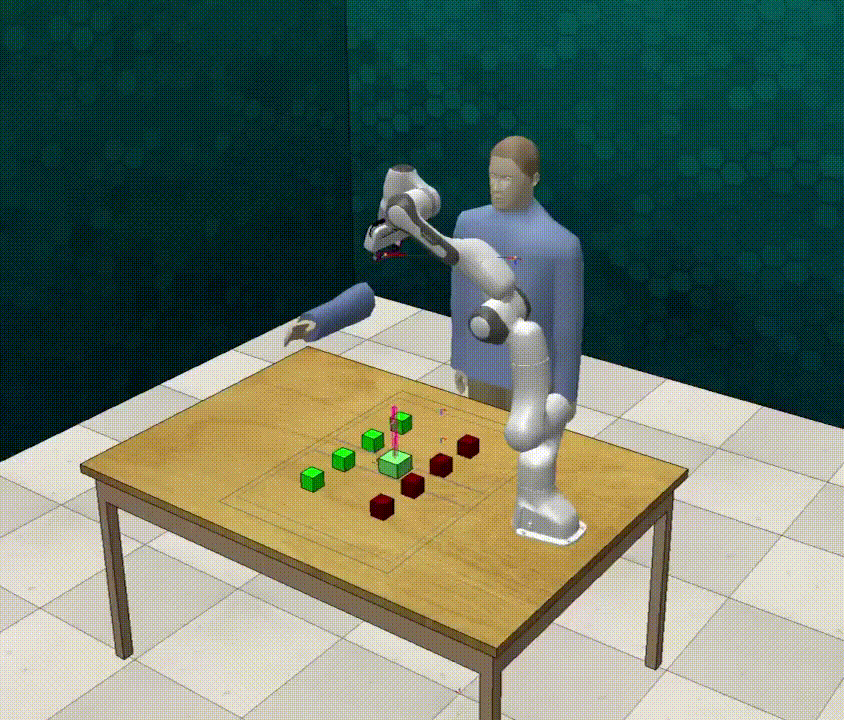
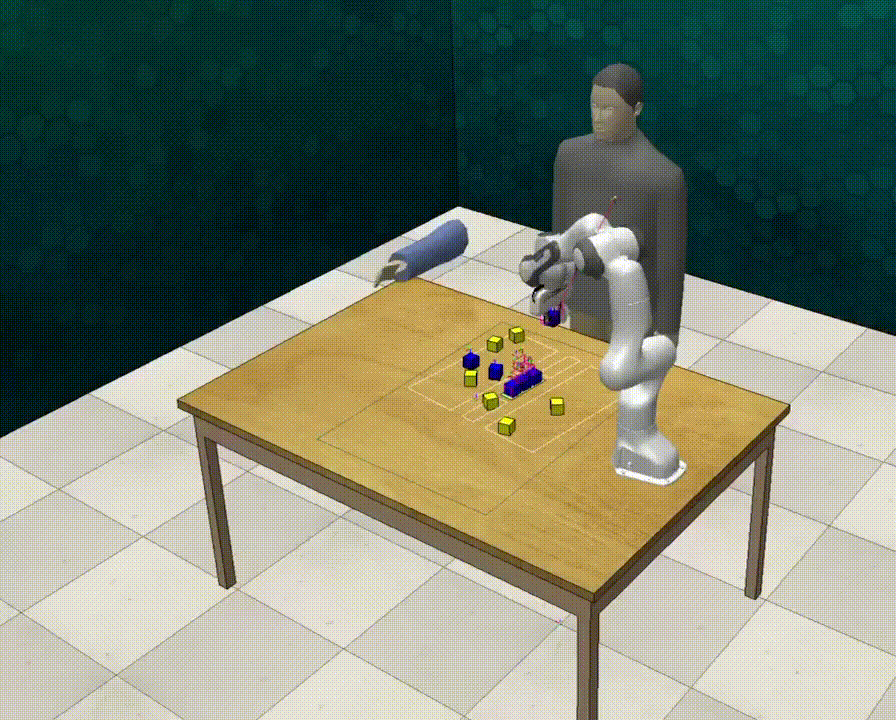
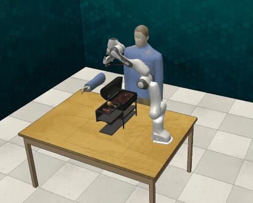

# SeRT

<div align="center">
  
  
  
  <br/>
  <br/>
</div>

This repository contains the official implementation of the paper **"SeRT: [Insert Your Full Paper Title Here]"**, submitted to ICML 2026.

## 🛠 System Requirements
We have tested the implementation on the following systems:
- **OS**: Linux (Ubuntu 20.04/22.04 recommended)
- **Python**: 3.8+
- **PyTorch**: 1.13+ (or your specific version)
- **CUDA**: 11.x (if GPU is required)

## 🚀 Installation
To install the necessary dependencies, please follow the steps below. We recommend using `conda` for environment management.

```bash
# 1. Create a conda environment
conda create -n sert_icml python=3.8 -y
conda activate sert_icml

# 2. Install PyTorch (Please adjust the command based on your CUDA version)
# Example:
pip install torch torchvision torchaudio

# 3. Install other dependencies
pip install -r requirements.txt
🏃 Quick Start (Reproduction)
To reproduce the main results presented in the paper, run the following command:

Training
Bash
python train.py --config configs/sert_default.yaml
Evaluation (Safety Check)
Bash
python evaluate.py --checkpoint checkpoints/sert_best.pth --task collaboration_task
📂 Project Structure
sert/: Core implementation of SeRT algorithm and Transformer models.

envs/: Robotics simulation environments and wrappers.

configs/: Hyperparameter configurations.

scripts/: Scripts for training and evaluation.
